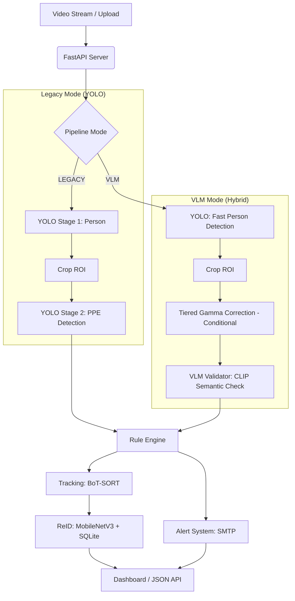

# PPE Detection Synergy Project

A production-grade Personal Protective Equipment (PPE) detection system featuring real-time tracking, persistent cross-video Re-Identification (ReID), and a hybrid AI pipeline combining YOLO speed with VLM accuracy.

## 🚀 Key Features

-   **Hybrid Pipeline Architecture**: Toggle between high-speed Dual-YOLO and zero-shot **VLM (CLIP)** validation.
-   **VLM Validation**: Uses Vision-Language Models (OpenAI CLIP) for high-confidence semantic verification of PPE compliance using Logit Margin scoring.
-   **Real-time Tracking**: Integrated **BoT-SORT** for consistent frame-to-frame identity persistence.
-   **Persistent Re-Identification (ReID)**: MobileNetV3-based embeddings to recognize individuals across multiple video sessions.
-   **Database Persistence**: SQLite storage for person profiles, embedding history, and compliance logging.
-   **Smart Multi-Stage Alerts**: Stability-aware SMTP alerts that trigger only after sustained violations.

## 🏗️ System Architecture

The project now supports two primary inference modes, configurable via `app/config.py`:



### Core Components

1.  **Detection Pipelines**:
    *   **Legacy**: Uses a cascaded YOLO approach (Full frame → Person Crop → PPE Model).
    *   **VLM**: Uses YOLO for localization and **CLIP (Contrastive Language-Image Pre-training)** for semantic validation of "wearing hardhat/vest".
2.  **Tracking & ReID**:
    *   **BoT-SORT**: Maintains frame-level association.
    *   **Embeddings**: 576-dim L2-normalized vectors generated by MobileNetV3.
3.  **State Management**:
    *   **SQL Persistence**: Tracks `global_id` assignments and alert history.
    *   **Violation Buffering**: Implements a time-threshold logic to avoid spamming alerts for transient occlusions.
4.  **Tiered Gamma Correction (GAMMA)**:
    *   **Adaptive Brightness Recovery**: Automatically calculates average pixel intensity for every detected person.
    *   **Tiered Enhancement**: If brightness falls below the threshold, the system applies non-linear Gamma Correction based on the intensity:
        *   **Deep Low-Light (Brightness < 30)**: Applies **Gamma 2.2** for aggressive detail recovery.
        *   **Moderate Low-Light (Brightness 30–50)**: Applies **Gamma 1.8** for balanced enhancement.
    *   **Benefit**: Significantly improves zero-shot VLM accuracy in shadowed areas or low-light CCTV footage by revealing textures without introducing the noise typical of linear amplification.
5.  **Dynamic Model Management (MLflow)**:
    *   **Remote Artifacts**: Supports fetching latest model weights directly from MLflow/DagsHub artifact repositories.
    *   **Automatic Fallback**: If the remote download fails or the file is corrupted, the system automatically reverts to the last known stable local weight file (`weights/best-stage2.pt`).
    *   **Lazy Loading**: Models are initialized asynchronously during app startup to ensure the API remains responsive.

## 🛠️ Setup & Configuration

### Pipeline Selection
Edit `app/config.py` to choose your preferred architecture:

```python
# app/config.py
PIPELINE_MODE = "VLM"  # "LEGACY" for pure YOLO, "VLM" for Hybrid
VLM_PROMPTS = {
    "hardhat": ["a person wearing a hardhat", "a person without a helmet"],
    "vest": ["a person wearing a safety vest", "a person without a safety vest"]
}
USE_GAMMA = True           # Toggle to enable/disable tiered enhancement
LOW_LIGHT_THRESHOLD = 50   # Threshold (0-255) to trigger enhancement
```

### MLflow Model Configuration
To use a managed model from MLflow, set the path in your `.env` file:
```bash
# .env
PPE_MODEL_PATH="mlflow-artifacts:/path/to/your/model.pt"
MLFLOW_TRACKING_URI="https://dagshub.com/YourUser/YourRepo.mlflow"
```
The app will automatically download and cache the model in `weights/mlflow_downloads/`.

### Local Execution
```bash
cd ppe-detection-synergy-project/ppe-detection-app
bash run_local.sh
```

## 📂 Project Structure

```text
ppe-detection-app/
├── app/
│   ├── main.py          # FastAPI application & MJPEG Streamer
│   ├── inference.py     # Main Logic: High-level pipeline controller
│   ├── model.py         # Dynamic model loading engine (Local/MLflow)
│   ├── vlm_validator.py # CLIP/SigLIP-based VLM validation logic
│   ├── extractor.py     # MobileNetV3 Feature Extraction
│   ├── database.py      # SQLite ReID layer
│   └── config.py        # Mode Toggle (LEGACY/VLM) & Prompts
├── weights/             # YOLO Model Weights
├── static_results/      # Snapshots of detected violations
└── run_local.sh         # Shell script to boot all services
```

## 📊 Available Models

- **best-stage2.pt**: (Recommended) Fine-tuned in 2 stages: 1st stage frozen backbone (9 layers) for 20 epochs, 2nd stage unfreezed all layers for 150 epochs. Best recall so far.
- **best-v1.pt**: Fine-tuned for 150 epochs with 10 layers frozen. Good stability, but lower recall for distance.
- **best-v3.pt**: YOLOv8-based variant.
- **best-v4-freeze9.pt**: Fine-tuned for 150 epochs with 9 layers frozen.
- **best-v2.pt**: Fine-tuned for 150 epochs with 5 layers frozen.
- **best-stage2-v8.pt**: (Recommended) Fine-tuned in 2 stages: 1st stage frozen backbone (10 layers) for 20 epochs, 2nd stage unfreezed all layers for 100 epochs. Best recall so far for YOLOv8 variant.

---
*Developed for the IITB-AIMLPractice-Project.*


# Steps
# branch - Main
# Command to run docker files
docker run -d -p 3000:80 --name ppe-ui-yollo11 ppe-detection-app-ui:latest
docker run -d -p 8000:8000 --name ppe-backend-yollo11 ppe-detection-app-backend:latest

# to test
Frontend UI	http://localhost:3000
Backend API	http://localhost:8000
FastAPI Docs	http://localhost:8000/docs

# to delete all non running container
docker container prune

#run ui and api locally
#switch to vlm_210526
Backend : uvicorn app.main:app --host 0.0.0.0 --port 9000
UI : python -m http.server 4000

#change end point in config.py
BASE_URL = "http://localhost:9000"