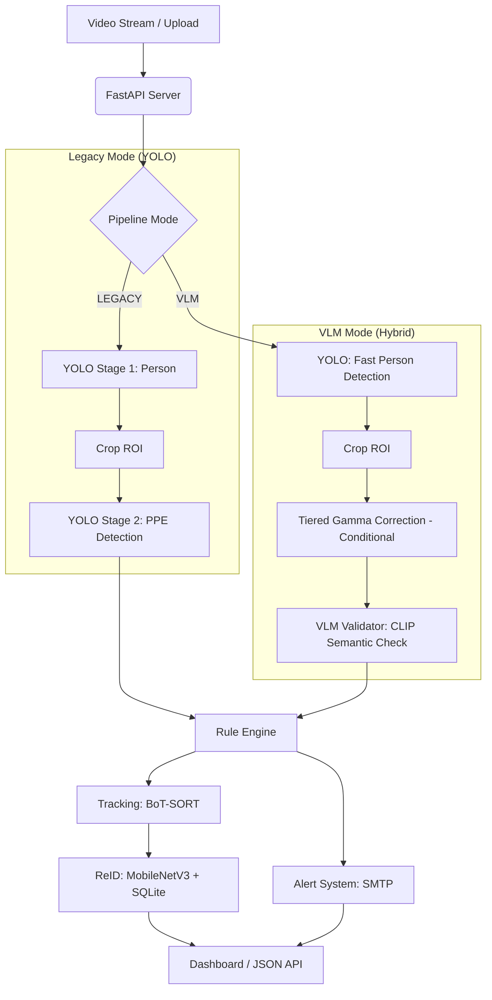
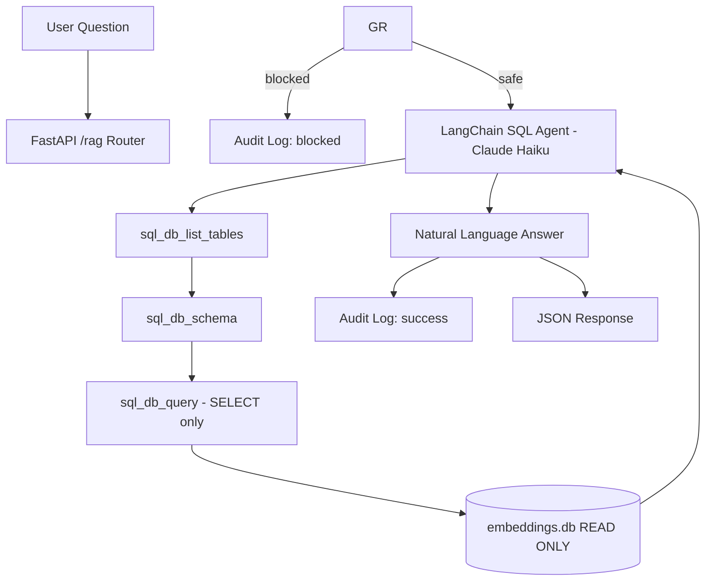

# PPE Detection Synergy Project

A production-grade Personal Protective Equipment (PPE) detection system featuring real-time tracking, persistent cross-video Re-Identification (ReID), and a hybrid AI pipeline combining YOLO speed with VLM accuracy.

## 🚀 Key Features

-   **Hybrid Pipeline Architecture**: Toggle between high-speed Dual-YOLO and zero-shot **VLM (CLIP)** validation.
-   **VLM Validation**: Uses Vision-Language Models (OpenAI CLIP) for high-confidence semantic verification of PPE compliance using Logit Margin scoring.
-   **Real-time Tracking**: Integrated **BoT-SORT** for consistent frame-to-frame identity persistence.
-   **Persistent Re-Identification (ReID)**: MobileNetV3-based embeddings to recognize individuals across multiple video sessions.
-   **Database Persistence**: SQLite storage for person profiles, embedding history, and compliance logging.
-   **Smart Multi-Stage Alerts**: Stability-aware SMTP alerts that trigger only after sustained violations.

## 🏗️ System Architecture

The project now supports two primary inference modes, configurable via `app/config.py`:



### Core Components

1.  **Detection Pipelines**:
    *   **Legacy**: Uses a cascaded YOLO approach (Full frame → Person Crop → PPE Model).
    *   **VLM**: Uses YOLO for localization and **CLIP (Contrastive Language-Image Pre-training)** for semantic validation of "wearing hardhat/vest".
2.  **Tracking & ReID**:
    *   **BoT-SORT**: Maintains frame-level association.
    *   **Embeddings**: 576-dim L2-normalized vectors generated by MobileNetV3.
3.  **State Management**:
    *   **SQL Persistence**: Tracks `global_id` assignments and alert history.
    *   **Violation Buffering**: Implements a time-threshold logic to avoid spamming alerts for transient occlusions.
4.  **Tiered Gamma Correction (GAMMA)**:
    *   **Adaptive Brightness Recovery**: Automatically calculates average pixel intensity for every detected person.
    *   **Tiered Enhancement**: If brightness falls below the threshold, the system applies non-linear Gamma Correction based on the intensity:
        *   **Deep Low-Light (Brightness < 30)**: Applies **Gamma 2.2** for aggressive detail recovery.
        *   **Moderate Low-Light (Brightness 30–50)**: Applies **Gamma 1.8** for balanced enhancement.
    *   **Benefit**: Significantly improves zero-shot VLM accuracy in shadowed areas or low-light CCTV footage by revealing textures without introducing the noise typical of linear amplification.
5.  **Dynamic Model Management (MLflow)**:
    *   **Remote Artifacts**: Supports fetching latest model weights directly from MLflow/DagsHub artifact repositories.
    *   **Automatic Fallback**: If the remote download fails or the file is corrupted, the system automatically reverts to the last known stable local weight file (`weights/best-stage2.pt`).
    *   **Lazy Loading**: Models are initialized asynchronously during app startup to ensure the API remains responsive.

## 🛠️ Setup & Configuration

### Pipeline Selection
Edit `app/config.py` to choose your preferred architecture:

```python
# app/config.py
PIPELINE_MODE = "VLM"  # "LEGACY" for pure YOLO, "VLM" for Hybrid
VLM_PROMPTS = {
    "hardhat": ["a person wearing a hardhat", "a person without a helmet"],
    "vest": ["a person wearing a safety vest", "a person without a safety vest"]
}
USE_GAMMA = True           # Toggle to enable/disable tiered enhancement
LOW_LIGHT_THRESHOLD = 50   # Threshold (0-255) to trigger enhancement
```

### MLflow Model Configuration
To use a managed model from MLflow, set the path in your `.env` file:
```bash
# .env
PPE_MODEL_PATH="mlflow-artifacts:/path/to/your/model.pt"
MLFLOW_TRACKING_URI="https://dagshub.com/YourUser/YourRepo.mlflow"
```
The app will automatically download and cache the model in `weights/mlflow_downloads/`.

### Local Execution
```bash
cd ppe-detection-synergy-project/ppe-detection-app
bash run_local.sh
```

## 📂 Project Structure

```text
ppe-detection-app/
├── app/
│   ├── main.py          # FastAPI application & MJPEG Streamer
│   ├── inference.py     # Main Logic: High-level pipeline controller
│   ├── model.py         # Dynamic model loading engine (Local/MLflow)
│   ├── vlm_validator.py # CLIP/SigLIP-based VLM validation logic
│   ├── extractor.py     # MobileNetV3 Feature Extraction
│   ├── database.py      # SQLite ReID layer
│   └── config.py        # Mode Toggle (LEGACY/VLM) & Prompts
├── weights/             # YOLO Model Weights
├── static_results/      # Snapshots of detected violations
└── run_local.sh         # Shell script to boot all services
```

## 📊 Available Models

- **best-stage2.pt**: (Recommended) Fine-tuned in 2 stages: 1st stage frozen backbone (9 layers) for 20 epochs, 2nd stage unfreezed all layers for 150 epochs. Best recall so far.
- **best-v1.pt**: Fine-tuned for 150 epochs with 10 layers frozen. Good stability, but lower recall for distance.
- **best-v3.pt**: YOLOv8-based variant.
- **best-v4-freeze9.pt**: Fine-tuned for 150 epochs with 9 layers frozen.
- **best-v2.pt**: Fine-tuned for 150 epochs with 5 layers frozen.
- **best-stage2-v8.pt**: (Recommended) Fine-tuned in 2 stages: 1st stage frozen backbone (10 layers) for 20 epochs, 2nd stage unfreezed all layers for 100 epochs. Best recall so far for YOLOv8 variant.

---
## 🤖 RAG & Agentic AI Module

Beyond detection, the system includes a natural language query layer built on top of the violation database — allowing users to ask questions in plain English instead of writing SQL, alongside automated reporting and quality evaluation.

### Architecture



### Core Components

1. **LangChain SQL Agent**:
   *    **Claude Haiku 4.5** generates SQl (`SELECT`, `COUNT`, `GROUP BY`, `JOIN`) agains the `violations` and `persons` tables based on the users question — no hardcoded queries.
   *    Restricted to a **read-only SQLite connection** (`mode=ro`), so even a malformed query cannot modify the database — enforced at the OS level, independent to the LLM's behavior.
2.  **Guardrails**:
    *   Regex-based **input validation** blocks prompt-injection attempts (e.g. "ignore previous instructions") and destructive SQL keywords before they ever reach the LLM.
    *   `include_tables` restricts the agent's visibility to only `violations` and `persons`.
    *   A **system prompt** defines scope, enforces SELECT-only behaviour and includes explicit jailbreak resistance instructions. 
3. **Structured Reporting (Pydantic)**:
    * `generate_safety_report()` — daily complaince summary with severity-classification (`LOW`/`MEDIUM`/`HIGH`/`CRITICAL`) and an AI-generated recommendation. 
    * `get_worker_risk_profile(person_id)` — individual worker violation history and risk level.
    * All outpus are validared through Pydantic models with field-level constraints, so malformed LLM output never silently propagates downstream.
4. **Audit Trail**:
    * Every query — successful or balcked is passed with timestamp, question, answer, and block reason to a separate audit database, exposed via `GET /rag/audit`. 
5. **RAG Evaluation (RAGAS)**:
    *   **Faithfulness** — verifies the agent's natural language answer is grounded in its own SQL query result(no hallucination)
    *   **Answer Relevancy** — verifies the answer actually addersses the question asked, scored via local HuggingFace enbeddings. 
    *   `ground_truth`-based metrics (e.g. Factual Correctness) were deliberately excluded — for a SQL-agent architecture, the agent's query result *is* the source of truth, so comparing against a static expected answer would be circular and go stale as new violations are logged.

### API Endpoints
 
| Method | Endpoint | Description |
|---|---|---|
| `POST` | `/rag/query` | Ask any natural language question about violations |
| `GET` | `/rag/report` | Generate a structured daily safety report |
| `GET` | `/rag/worker/{person_id}` | Get risk profile for a specific worker |
| `GET` | `/rag/evaluate` | Run RAGAS evaluation and return quality scores |
| `GET` | `/rag/audit` | View recent query audit trail |
 
All endpoints are documented and testable via Swagger UI at `/docs`.
 
```bash
curl -X POST http://localhost:8000/rag/query \
    -H "Content-Type: application/json" \
    -d '{"question": "Which worker has the most violations?"}'
```

```json
{
    "question": "Which worker has the most violations?",
    "answer": "Person 1 has the most violations with 2,157 violations."
}
```

### Evaluation Results

```json
{
  "faithfulness": 1.0,
  "answer_relevancy": 0.916
}
```

A faithfulness score of 1.0 confirms the agent never fabricates numbers — every answer traces back to an actual SQL query result, which is the critical property for a safety-compliance system where data accuracy has real-world consequences.

### Setup
Add to `.env`
```bash
ANTHROPIC_API_KEY=sk-ant-xxxxxxxxxxxx
``` 

Run via Docker (same as main app — see Local Execution above), and then:
```text
http://localhost:8000/docs
```

### Module Structure

```text
app/rag/
├── rag_agent.py        # SQL Agent initialization (LangChain + Claude)
├── rag_models.py        # Pydantic schemas for requests/responses
├── rag_reports.py        # Structured report & risk profile generation
├── rag_evaluation.py    # RAGAS-based quality evaluation
├── guardrails.py        # Input validation & prompt-injection defense
├── rag_audit.py         # Query audit logging
├── rag_router.py         # FastAPI endpoints
└── cli.py               # Standalone command-line interface
```

**Note:**`app/rag_assistant.py` (project root) is an earlier ChromaDB vector similatiry RAG prototype, kept for reference. It was superseded by the LangChain SQL Agent above because the violation data is structured — questions like *"how many violations today?"* need an exact `COUNT(*)`, not an approximate text match.

*Developed for the IITB-AIMLCapstone-Project.*
